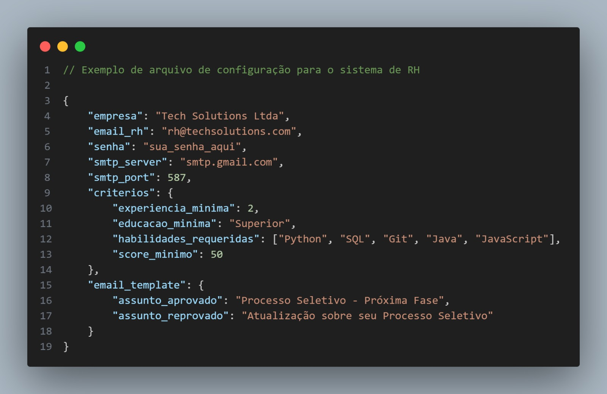
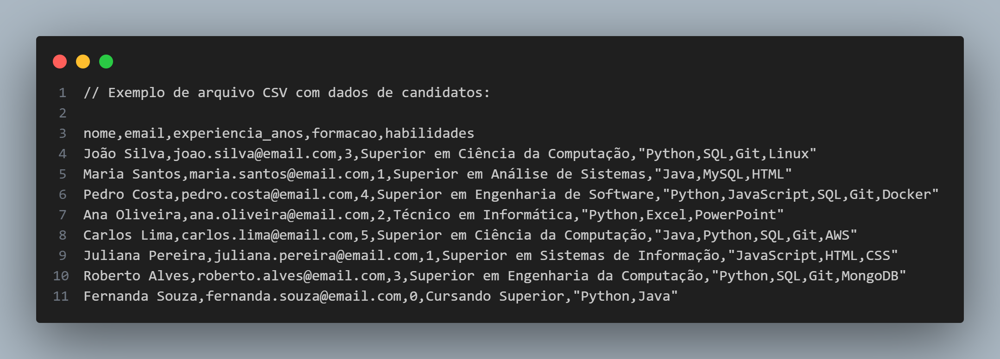
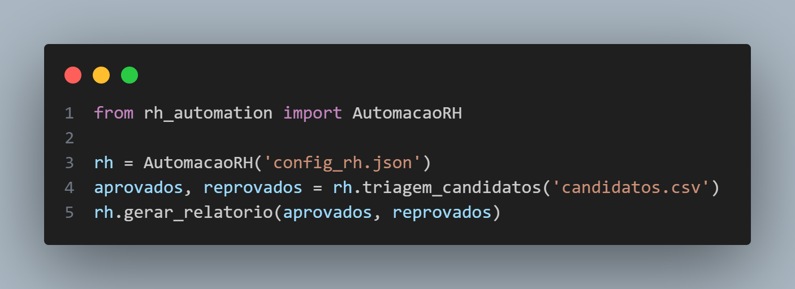
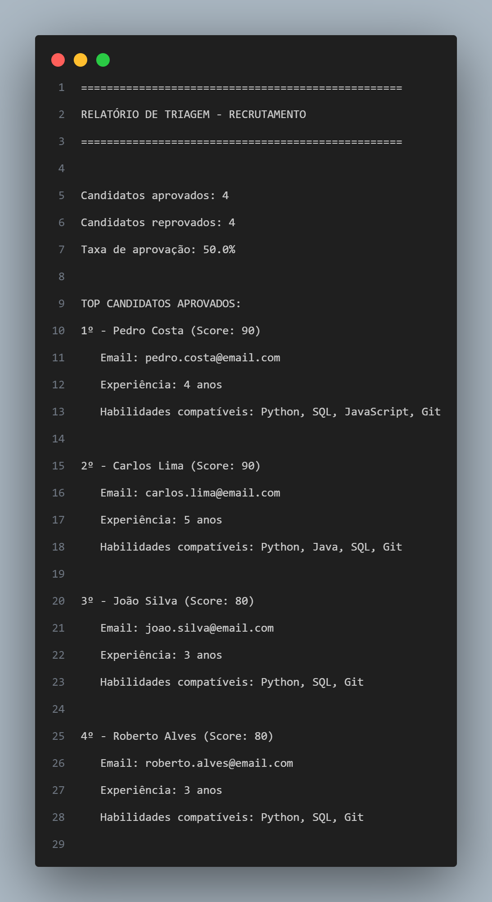
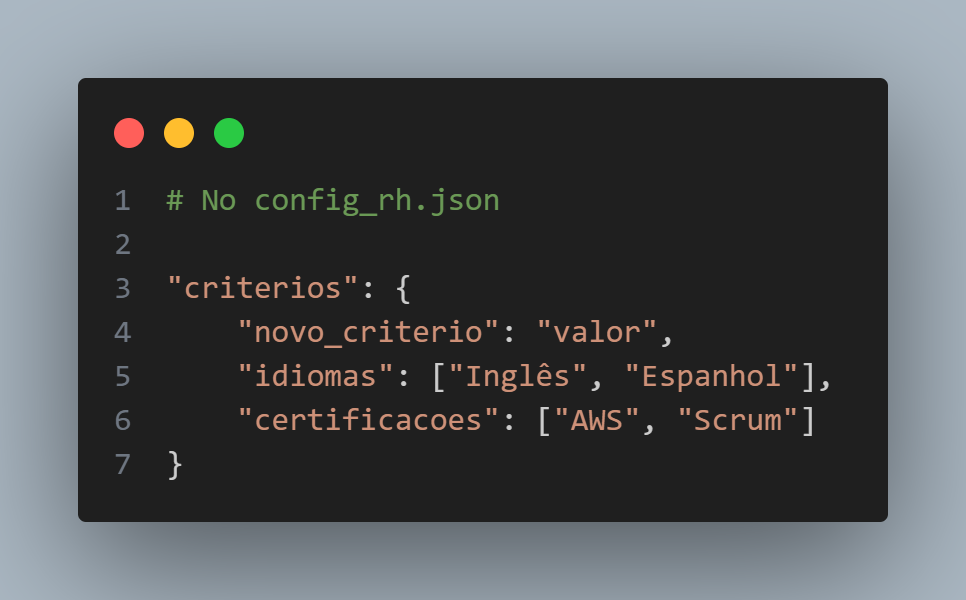
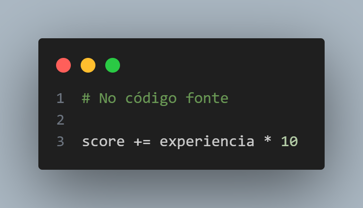

# 🤖 **Automação de Processos de RH - Sistema de Triagem Inteligente**


**Um sistema inteligente em Python para automatizar a triagem inicial de currículos e otimizar processos de recrutamento em empresas.**

## ✨ **Funcionalidades Principais**

- **🔍 Triagem Automática** de candidatos baseada em critérios personalizáveis
- **📊 Sistema de Pontuação** inteligente para ranking de candidatos
- **📧 Comunicação Automatizada** com aprovados e reprovados
- **📈 Relatórios Detalhados** com métricas de recrutamento
- **⚙️ Configuração Flexível** via arquivo JSON

## 🚀 **Como Funciona**

### Processo de Triagem
1. **Entrada de Dados**: Importação de currículos via CSV
2. **Avaliação por Critérios**:
   - ✅ Experiência profissional
   - ✅ Formação acadêmica
   - ✅ Habilidades técnicas
3. **Pontuação Automática**: Cálculo de score baseado nos critérios
4. **Classificação**: Separação entre aprovados e reprovados
5. **Comunicação**: Envio automático de emails

### Exemplo de Score
```python
Experiência ≥ 2 anos: +30 pontos
Formação Superior: +20 pontos
Cada habilidade compatível: +10 pontos
Score mínimo para aprovação: 50 pontos
```

## 📁 **Estrutura do Projeto**
```
rh-automation/
├── 📄 rh_automation.py          # Classe principal
├── ⚙️ config_rh.json            # Configurações do sistema
├── 👥 candidatos.csv            # Exemplo de dados de entrada
├── 📊 relatorios/               # Relatórios gerados
└── 📋 README.md                 # Documentação
```

### 🛠️ Tecnologias Utilizadas
- **Python** 3.8+
- **Pandas** - Manipulação de dados
- **SMTPLib** - Envio de emails
- **JSON** - Configurações
- **CSV** - Importação de dados

## ⚡ **Quick Start**

### 1. Clone o Repositório
```
git clone https://github.com/fzeglan/rh-automation.git
cd rh-automation
```
### 2. Instale as Dependências
```
pip install pandas
```
### 3. Configure o Sistema
Edite o arquivo ```config_rh.json```:



### 4. Prepare os Dados
Crie um arquivo ```candidatos.csv```:


### 5. Execute o Sistema


## 📊 **Exemplo de Saída ( Terminal )**
```
📊 RELATÓRIO FINAL DA TRIAGEM
=============================
✅ Candidatos aprovados: 4
❌ Candidatos reprovados: 4
📈 Taxa de aprovação: 50.0%

🏆 TOP CANDIDATOS APROVADOS:
1º - Carlos Lima (Score: 90)
2º - Pedro Costa (Score: 80)
3º - João Silva (Score: 80)
```
## 📊 **Exemplo de Saída ( Arquivo TXT )**



## 🎯 **Casos de Uso**
- **Startups** - Otimizar processos de recrutamento com equipes enxutas
- **Empresas de TI** - Triagem técnica automatizada
- **Consultorias** - Processos seletivos em larga escala
- **HR Tech** - Como base para sistemas mais complexos

## 💡 **Benefícios**
- ⏱️ **Economia de Tempo**: Redução de 80% no tempo de triagem inicial
- 🎯 **Precisão**: Critérios objetivos e consistentes
- 📈 **Escalabilidade**: Processa centenas de currículos em minutos
- 💼 **Personalizável**: Adaptável a diferentes vagas e perfis

## 🔧 **Customização**

### Adicionar Novos Critérios



### Modificar Pesos da Pontuação



## 🤝 **Contribuição**
**Contribuições são bem-vindas! Sinta-se à vontade para**:

1. **Fork o projeto**
2. **Crie uma branch para sua feature (```git checkout -b feature/AmazingFeature```)**
3. **Commit suas mudanças (```git commit -m 'Add some AmazingFeature'```)**
4. **Push para a branch (```git push origin feature/AmazingFeature```)**
5. **Abra um Pull Request**

**⭐ Se este projeto te ajudou, deixe uma estrela no repositório!**
